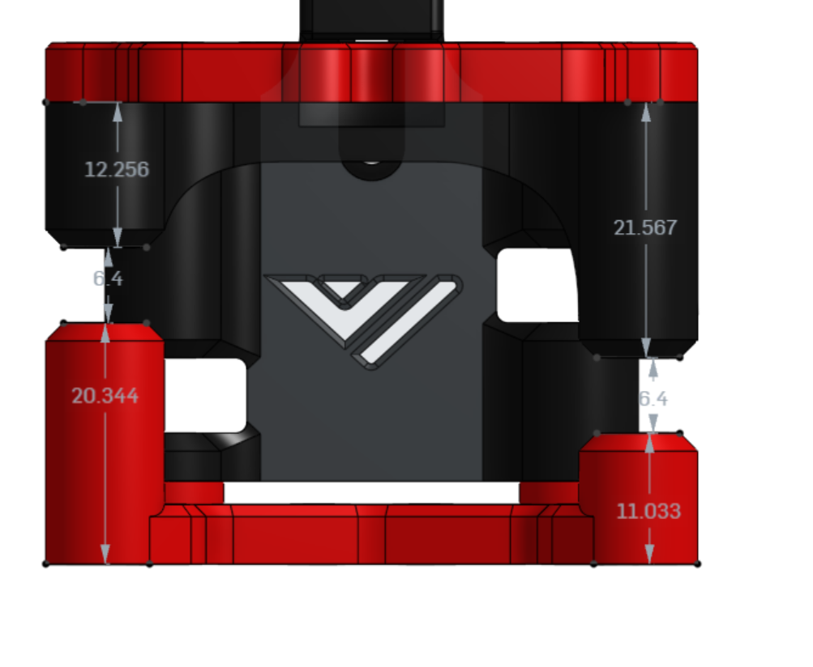
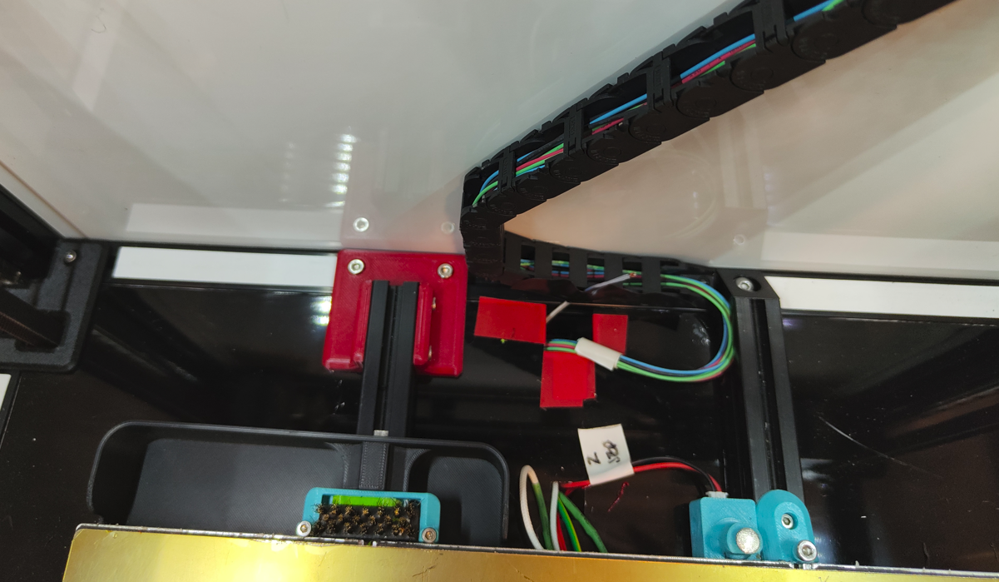

Many thanks to  the VzBot and the Voron team for making excellent printers.

# VORON-2.4-TOP-MOUNT-X-RAIL

VORON-2.4-TOP-MOUNT-X-RAIL
- 2023-06-19 - updated to acomodate VZ lasercut tool head after plastic melted.
- 2023-04-21 - Updated to work with Offical VZ-PrintablePrintHead - https://github.com/VzBoT3D/Vz-Printhead-Printed
- 2023-02-01 - v4 uploaded and running. (LEGACY)

# Features

- Top Mount X Rail
- Simple install just new xy parts and stock standard VZ_Printable tool head.
- No major belt changes just the XY idler belts are now routed to rear of x axis beam. No cuttin no trimming of belts required.
- Ultra lightweigth design with high accelerations. See Input Shaper graphs below.
- 682gram Total X-Rail Full System Install.
- Bed Printable area ~336x ~(y is actually greater to access end stop and brush) 324y

# Requirements

- Sensorless homing! Recommend Y home 1st with 100mm back off. Home X 100mm back off. Move Center bed Home Z with BEACON
  - https://docs.vorondesign.com/community/howto/clee/sensorless_xy_homing.html (remember to adjust homing acceleration to 1k)
  - Beacon Probe 
  - Umbelical or some kind of no cable chain system.
  - Move the Z-Axis chain under the gantry. and replace the bed mount so they chain can sit tucked under between. - https://www.printables.com/model/279739-voron-can-bus-z-chain-move

- LEGACY Probe Requirements
  - klicky prob
  - https://github.com/jlas1/Klicky-Probe
  - My Custom adjustable KlickyProbe gantry mount that suits custom heights of different toolhead FanDucts in the STL folder.

# Inspired By

- https://github.com/VzBoT3D/Vz-Printhead-Printed
- https://github.com/VzBoT3D/VzBoT-Vz330

# BOM Build List Of Materials

New Material Requirements.
 - 20x20 Carbon Fibre Rod at ~463 mm length
 - x4 M5 x 50mm Bolts (preferably Smooth Shaft) (M5x40mm pins work however you can control the idler pressure with bolts)
 - x4 M5 x 8mm HeatSet Nuts 
 - x4 M4 x 18mm cap head bolts (bottom of xy idlers)
 - x4 M4 x 12mm cap head bolts or dome (top of xy idlers)
 - x4 M5 1mm Shim Washers
 Re Use of Existing Hardware
 - use existing x8 M3 Bolts to mount to y linear rails.
 - use existing M5 Washers, Idlers, GT20 Pullys.

# Official VZPrintHead Support (MIRRORED),
2023-04-21 VZ PrintablePrintHead Supported.
Requirements to use the VZ-PrintablePrintHead mirror the Belt componetns on the X-axis.
Mirrored parts are:
- bottom plate round standoff
- front round standoff
- back plate round standoff 

Reference Spec Images before a Mirror.

The idlers now match the VZ PrintablePrintHead

# InputShaper from V3

 

# 2023-06-19 current state

# YouTube

- Watch the videos for my build journey

# zChain Hidden

 - Z-Chain under the gantry extrusion is crushed especially with short hotends. Custom length hotend extension can be required. I also designed a new bed frame extrusion mount to allow the zChain to squeeze between. See STL downloads.

# Feedback

 - if you install this please send me a photo on discord!
 - TopMountXRail@jc84.com
 - Discord julianjc84#7938
 
 # CAD
 
 https://cad.onshape.com/documents/a9a183adf9bba502a9a97bd8/w/d7fe18026210d20805620ae9/e/9a3a7e08fe09ca9430e55a9d

 # RELATED MODS
 https://github.com/YoDan-V2-2027/Voron_Vz_Printhead_Mod
 