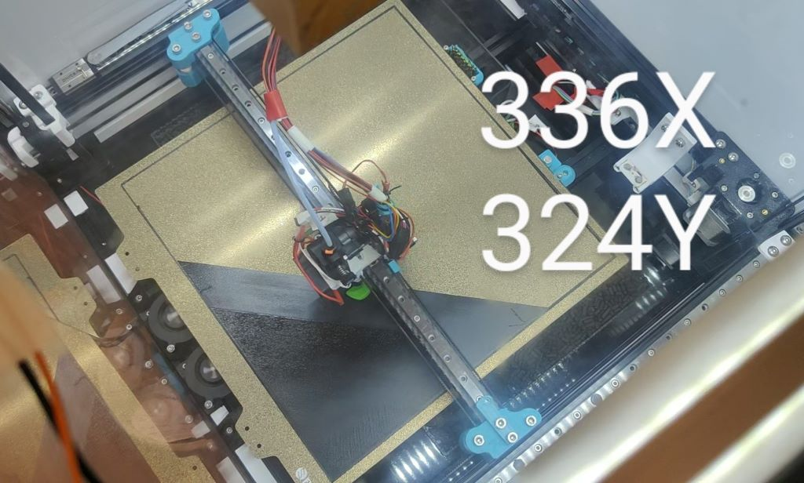
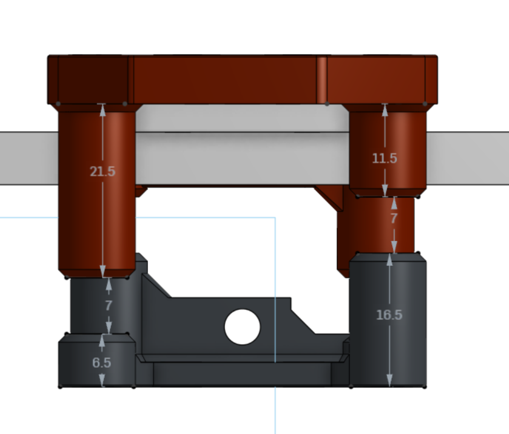
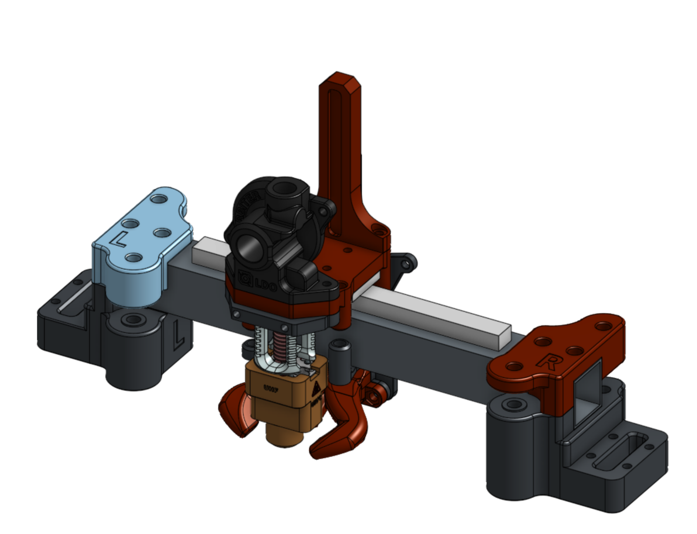
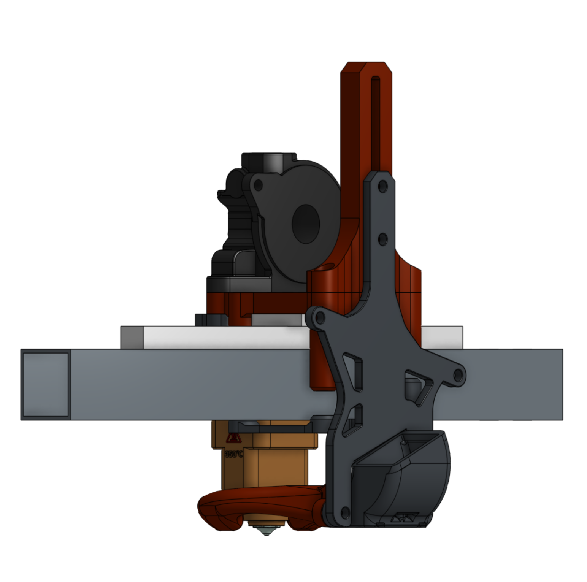
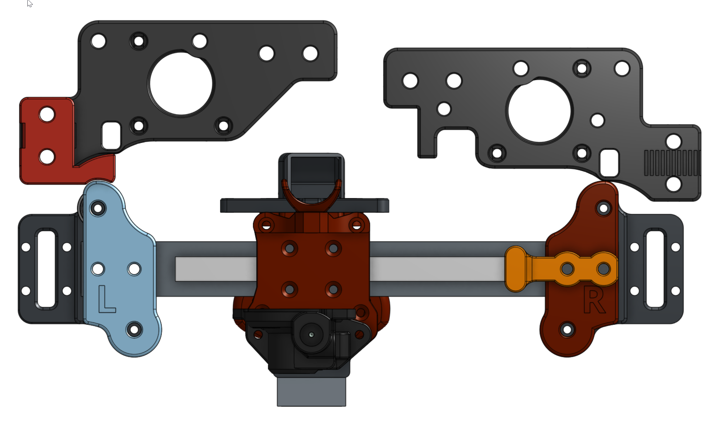

Many thanks to the VzBot and the Voron team for making excellent printers.

# VORON-2.4-TOP-MOUNT-X-RAIL

VORON-2.4-TOP-MOUNT-X-RAIL
- 2023-02-01 - v4 uploaded and running.

# Features

- Top Mount X Rail
- Simple install just new xy parts only. and modified VZPrintable tool head for the Dragon UltraHighFlow.
- No major belt changes just the idler belts are now routed to rear of x axis beam. No cuttin no trimming of belts required.
- Ultra lightweigth design with high accelerations. See Input Shaper graphs below.
- 682gram Total X-Rail Full System Install.
 
- Bed Printable area 336x 324y (TO DO:the bed can be pushed back ~4mm to increase ethe Y to 328ish)
 

# Requriments

- Sensorless homing. Recommend Y home 1st with 100-150mm back off. Home X. Center over Z EndStop. Home Z.
  - https://docs.vorondesign.com/community/howto/clee/sensorless_xy_homing.html
- klicky prob
  - https://github.com/jlas1/Klicky-Probe
  - My Custom adjustable KlickyProbe gantry mount that suits custom heights of different toolhead FanDucts in the STL folder.
- Umbelical or some kind of no cable chain system.
- Move the Z-Axis chain under the gantry. and replace the bed mount so they chain can sit tucked under between.
  - https://www.printables.com/model/279739-voron-can-bus-z-chain-move

# Inspired By

- https://github.com/VzBoT3D/Vz-Printhead-Printed
- https://github.com/VzBoT3D/VzBoT-Vz330

# RECENT DEVELOPMENTS
2023-04-02 It has come to my attention that the VZ belt heights and the voron belt heights are almost identical with in 1mm of eachother.
a close enouch spec for me to be happy. However the horizontal alignment is far greater at 38mm compared to 31mm of the idlers. It will angle the belts....

You also have to Mirror the Belt componetns on the X-axis of the VZ-Head.

Mirrored parts would be. but horizontal alignment angles belts. 
- bottom plate round standoff
- front round standoff
- back plate round standoff 

Reference Spec Images for the front belths. Rear belts are mirrored / identical

ISSUE are that the standard vzprint head is alot longer at ~37mm compared to the RatRig build of ~31 and my idlers ~31
seems the ratrig is best match however the belt for the ratrig are to suit 9mm and need inverting as well.

Can see the angled belts on the stock VZ Printhead 37mm Spacing.

# What to update i'm stuck

I want to use a Stock VZ printhead. - Standard or the RatRig.
RR matches from the top spacing. however is designed for 9mm belts. So the front vertical is off.
VZ Standard is extra long at 37mm and angles the belts. Looking down from top. However vertical belts match when mirrored.
DO i.
1) re draw the Front and Rear of the Ratrig to suit Voron 6mm belts
OR
2) make the Idlers wider to suit the standard VZ print head. - removing the need for the z- Belt Collision spacers. and loosing maybe possibly minimal front Y bed..

I think make XY idlers wider to suit the standard VZ printHead....

# InputShaper

 

# V3 Images - legacy V4 has updates see CAD @ bottom.

 

 

 

 

 

 

# YouTube

- Watch the videos for my build journey

# Known Issues

- v4 has no known issues.

# zChain Hidden

 - Z-Chain under the gantry extrusion is crushed especially with short hotends. Custom length hotend extension can be required. I also designed a new bed frame extrusion mount to allow the zChain to squeeze between. See STL downloads.

# v4 Improvmentns Included

- Gantry collision solved by a belt clip that pads out the frame to prevent the 5015 fan from colliding. estimate Y reduction of 8mm

# Feedback

 - if you install this please send me a photo on discord!
 - TopMountXRail@jc84.com
 - Discord julianjc84#7938
 
 # CAD
 
 https://cad.onshape.com/documents/a9a183adf9bba502a9a97bd8/w/d7fe18026210d20805620ae9/e/9a3a7e08fe09ca9430e55a9d

 # RELATED MODS
 https://github.com/YoDan-V2-2027/Voron_Vz_Printhead_Mod
 